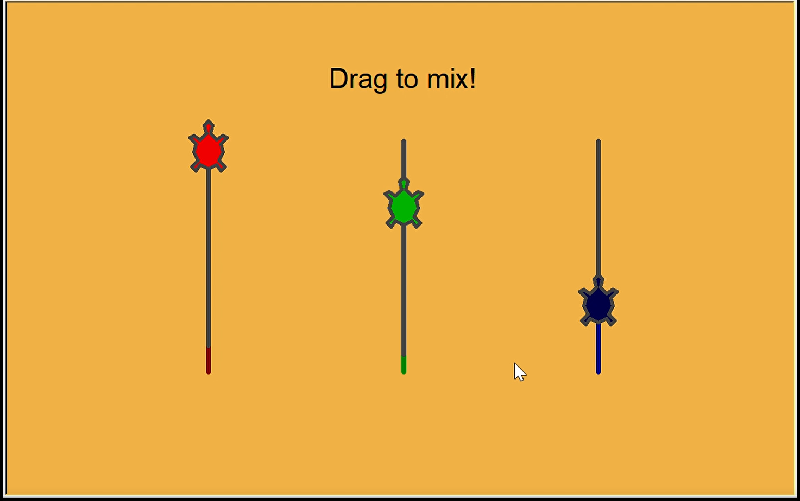

# Color-Mixer

## Description
This is an additive color mixing program. It allows users to mix color based on the classical primary colors - red, green, and blue. Users can change the concentration of each color. The program would mix these colors and blend it out on the background.

## Prerequisite
Need dependency: python turtle library. 
You can do this by running ```pip install turtle```\
(For python version 3 this package is pre-installed).

## How to run
Simply run ```python color_mixer.py```

## How it works
User's mouseevent changes the y-axis coordinates of the three primary colors. A fillcolor function would then take these coordinate values as inputs and generate a corresponding background color.

## Program in action
Here are some captures of the program output.
Check out the video demo by downloading the video_demo.mp4 file. Or... try it yourself!




